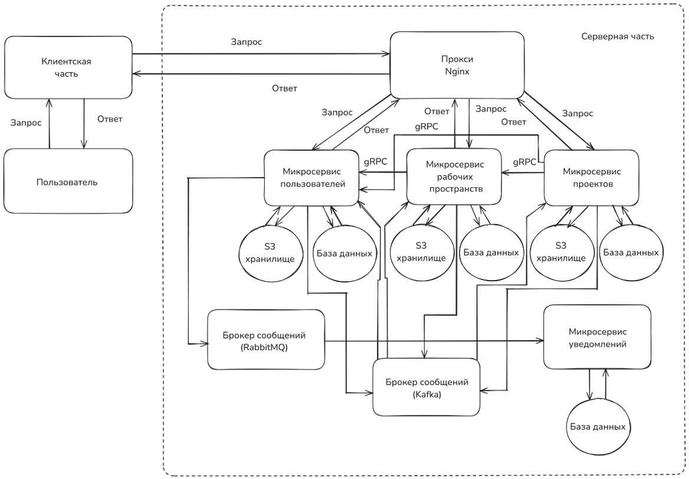
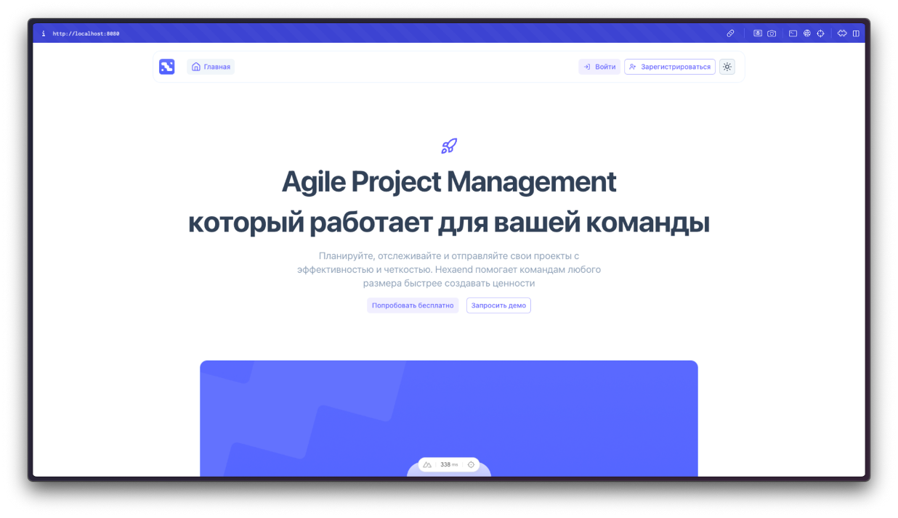
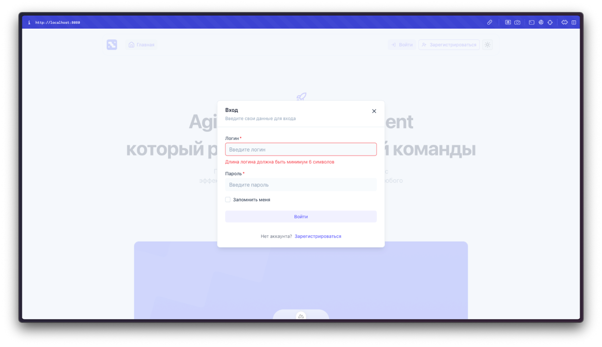
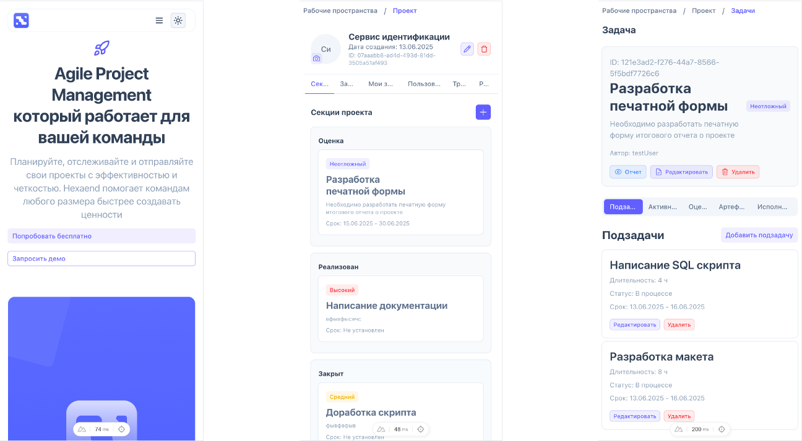

# Система управления проектами

Микросервисная система управления проектами с поддержкой рабочих пространств, проектов, пользователей и системой уведомлений. Проект разработан с учетом принципов масштабируемости, отказоустойчивости и разделения ответственности между сервисами.

## 📌 Основной стек и технологии

- **Backend:** ASP.NET Core (C#)
- **Frontend:** Nuxt.js
- **База данных:** PostgreSQL
- **Хранилище файлов:** MinIO (S3-совместимое)
- **Брокеры сообщений:** Kafka, RabbitMQ
- **Секрет-менеджмент:** HashiCorp Vault
- **Мониторинг и логирование:** Graylog, Jaeger UI
- **CI/CD:** GitHub Actions + self-hosted runners (на VPS)

## 🧩 Архитектура

Проект состоит из следующих микросервисов:

| Сервис                 | Назначение                                |
|------------------------|-------------------------------------------|
| [BW.IdentityService](https://github.com/dreadew/BW.IdentityService)     | Авторизация и аутентификация пользователей |
| [BW.WorkspaceService](https://github.com/dreadew/BW.WorkspaceService)   | Управление рабочими пространствами         |
| [BW.ProjectService](https://github.com/dreadew/BW.ProjectService)       | Управление проектами                      |
| [BW.NotificationService](https://github.com/dreadew/BW.NotificationService) | Отправка и обработка уведомлений         |
| [BW.Composes](https://github.com/dreadew/BW.Composes)                   | docker-compose оркестрация сервисов      |
| [BW.Common](https://github.com/dreadew/BW.Common)                       | Общие библиотеки и утилиты                |

### 🗂️ Архитектурная схема

## 🚀 Возможности

- Регистрация и аутентификация пользователей
- Создание и управление рабочими пространствами
- Управление проектами внутри рабочих пространств
- Асинхронная отправка уведомлений (почта, события)
- gRPC-взаимодействие между сервисами
- Использование Kafka и RabbitMQ для обработки событий
- CI/CD пайплайны с использованием GitHub Actions и self-hosted runners на VPS

## 🛠️ Мониторинг и логирование

- **Graylog** — централизованное логирование
- **Jaeger UI** — трассировка запросов и распределённый трейсинг

## 🖼️ Скриншоты

### Главная страница

### Валидация на клиентской части

### Адаптация под мобильные устройства
